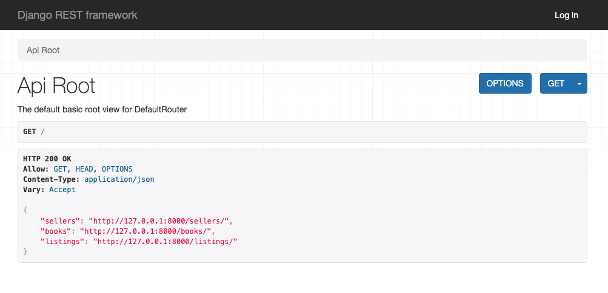

# Booked-back-end

Back-end for Booked prototype. Team Gold, CS 411W.
The contents of this README will be focused on:

- Project installation
- Usage of scraping functionality
- Accessing of database
- REST API
  - Endpoints and Model Overview
  - Data Requests and Filtering

## Project Installation

_Assuming this repository has been successfully cloned,_

To run the contents of this repository:

- Install all dependencies
  - Inside the main directory, navigate to **DataBase/bookedDataBase**:
    - `cd DataBase/bookedDataBase`
  - In this directory, there are two requirements files. One is for pip environments, and one for conda. Both _should_ work.
    - To install pip environment:
    ```
    python3 -m venv env
    source env/bin/activate
    pip install -r pip_requirements.txt
    ```
    - To install conda environment:
    ```
    conda create --name <env> --file conda_requirements.txt
    ```

## Usage of Scraping Functionality

To use the webpage scraper:

1. Navigate to DataBase/bookedDataBase/ directory
2. In this directory, run the following command:
   - `python manage.py runscript scrape_insert --script-args "your_search_string"`
     **your_search_string**: String Parameter. The search criteria for the web scraping. It can be a book title, author, isbn, etc.
3. Running the above command will automatically insert items into the database if it yielded books not already there.
   - Example:
     If the database does not contain any books by Toni Morrison, the command `python3 manage.py runscript scrape_insert --script-args "Toni Morrison"` will scrape websites using the search string "Toni Morrison", check for existence of each listing in the database, insert all new books found.

**Considerations:**

- The scraper only scrapes websites for the following two vendors:
  - [Prince Books](https://www.prince-books.com/)
  - [Second and Charles](https://www.2ndandcharles.com/)
- The library used to run the scraper (Selenium) tends to take a lot of processing power. It _sometimes_ crashes Google Chrome web browser.
- All results of running the script are added to the database, not outputed anywhere.

## Accessing of Database

To access and visualize database contents:

1. Navigate to DataBase/bookedDataBase/ directory
2. Run the following command: `python manage.py runserver`
3. Open web browser of choice (the right choice is always Crome...)
4. On the browser, go to localhost: **http://127.0.0.1:8000/**
5. Click on any of the three endpoints that appear on the screen to see the data:
   

## REST API Usage

### Endpoint and Data Models Overview

The REST API has three end points:

1. **sellers/**
   Returns all the **sellers** in the database. Each **seller object** is in the form:
   {
   StoreName: (str) Name of the vendor,
   StoreSite: (url) Link to the vendor's website,
   locations: (list) List of **addres objects**
   }

   - Locations contains a list of **addresess** for physical store locations. The **address object** is in the following form:
     {
     address_line: (str) The street name, number, and
     apt or suite number if applicable, of a physical location,
     city: (str) City of location
     state: (str) Full name of state (Virginia, NOT VA)
     phone_number: (str) Store's listed phone number
     zip_code: (str) Location's zip code.

   }

2. **books/**

   Returns all the **books** stored in database. Each **book object** is in the follwing form:

   {
   isbn: (str) ISBN value of book,

   title: (str) Book title,

   author: (str) Book author,

   binding: (str) Two only possible values are
   "Paperback"or "Hardcover"

   availability: (list) List of **listing objects**

   }

3. **listings/**

   Returns all the **listings** stored in the database. Each **listing object** is in the following form:

   {
   book_store: (str) Name of bookstore where book
   is available,
   price: (float) Dollar value of book from book_store
   condition: (str) Two only possible values are "Used"
   or "New"
   link_url: (url) Link to the seller's book listing
   }

## Data Requests and Filtering

### Hampton Roads Bookshops:

Dog Eared Books: Inventory not available online

Barnes and Noble

The Way We Were: No Website available

Bender's Books and Cards: No Website available

Prince Books

Paperbacks Ink: Inventory not available online

Book Owl: No Website available

Jeannie's Used Books: No Website available

afk Books and Records: No Website available

2nd and Charles

Book Exchange: Inventory not available online

Eleanor's Norfolk: Inventory not available online

# Populate DJANGO ORM Database commands:

use the automation script, automationFill.py path: .../Booked-back-end/DataBase/bookedDataBase/automationFill.py

# Server update

after the automation script runs,run python manage.py makemigrations to update the database
